<div align="center">
  
</div>

<div align="center">

[](https://josemanuelyc.vercel.app)
[](https://www.linkedin.com/in/joseyanez07/)
[](mailto:joseyanezcontact@gmail.com)

</div>

<br/>

> Building scalable systems, optimizing server performance, and engineering
> AI-driven automation.

Backend developer who enjoys designing clean architectures, well-tested APIs,
and automation that removes friction from real products. Always learning —
currently going deeper into AI integration.

## About

```typescript
import { Developer } from '@yanez/core'

export class JoseYanez implements Developer {
  readonly role = 'Backend Developer'

  readonly focus: string[] = [
    'Microservices Architecture',
    'AI Integration · LangChain',
    'Scalable Cloud Solutions'
  ]

  async build(): Promise<void> {
    await this.designRobustAPIs()
    await this.automateWorkflows({ tools: ['n8n', 'Botpress'] })
    await this.deployToCloud('AWS')
  }
}
```

## Tech Stack

**Backend &amp; APIs**


**Testing, DevOps &amp; Cloud**


**Frontend**


**AI &amp; Automation**

[](https://www.langchain.com/)
[](https://openai.com/)
[](https://n8n.io/)
[](https://botpress.com/)

## GitHub Activity

<div align="center">


</div>

## Let's Connect

Open to backend and AI-integration work, and always happy to trade ideas.

<div align="left">

[](https://josemanuelyc.vercel.app)
[](https://www.linkedin.com/in/joseyanez07/)
[](mailto:joseyanezcontact@gmail.com)

</div>

---

<div align="center"><sub>Designing robust systems, one commit at a time.</sub></div>
